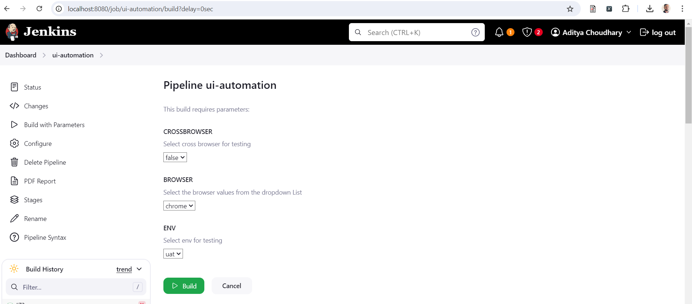
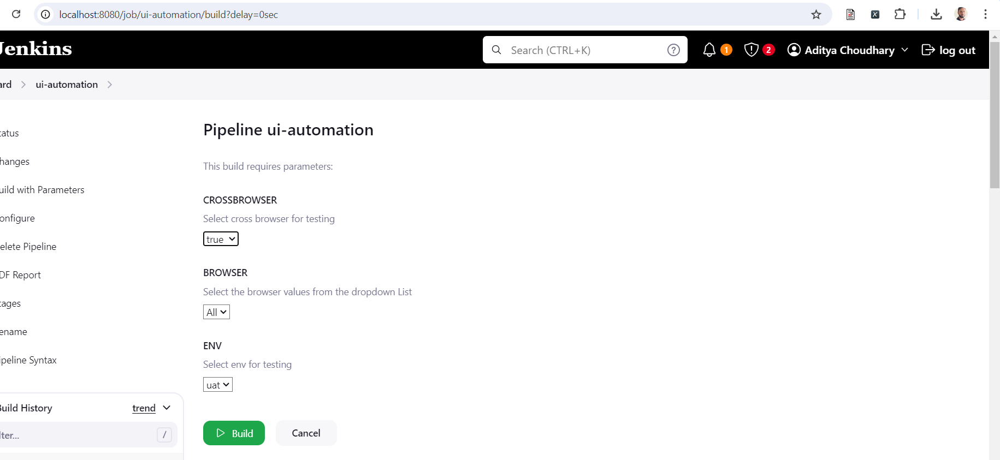

# Test Automation with Java and Selenium
This web test automation framework is built using Selenium with Java and Cucumber. I have used BDD framework to write our feature file using Jherkin language.
I have used page object model for reusability and easy maintenance. I have used Maven for build and maintain all project dependencies and plugins.

1. IntelliJ IDEA Community 
2. Programming Language -> Java 
3. Build Tool -> Maven
4. Web Test Automation Tool - Selenium 
5. Test Framework -> Cucumber and TestNG
6. Design Pattern -> Page Object Model (POM)
7. WebDriverManager is used for managing the drivers.

### Test Execution - Command line
mvn test -DsuiteXmlFile=testng.xml

mvn test -DsuiteXmlFile=testng.xml -Dbrowser=firefox -Denv=uat

mvn test -DsuiteXmlFile=testng.xml -Dbrowser=chrome -Denv=uat

For cross browser-
mvn test -DsuiteXmlFile=crossbrowser-testng.xml

### Parallel Execution in Cucumber - 
Parallel testing in Cucumber is the ability to execute Cucumber scenarios in parallel, allowing multiple scenarios to run simultaneously and speeding up the overall test execution time.

#### 1. Create ThreadLocal variable in DriverManager class - 
We use ThreadLocal class to create a ThreadLocal variable of type WebDriver.Each thread running a Cucumber scenario or step can have its own WebDriver instance, isolated from other threads.
This approach ensures thread safety and prevents conflicts when executing scenarios in parallel.

private static ThreadLocal<WebDriver> tldriver = new ThreadLocal<>();

#### 2. Create TestRunner File
This runner class extends AbstractTestNGCucumberTests which has scenarios methods defined. We override the scenarios method to run it in parallel mode.

```java
    @Override
    @DataProvider(parallel = true)
    public Object[][] scenarios() {
        return super.scenarios();
    }
```  

### Cross Browser Testing in Cucumber -

#### 1. Create a testng.xml file
testng.xml file allows to configure test suites and parameters for text execution. Suppose we want to run test on multiple browser using the same code base.
We need to create a suite tag and within it we need to mention the test. We can have chrome test firefox test and safari test.

Parameterization in Selenium refers to the process of dynamically passing parameters or input data to test methods or test scripts. This allows to execute the same test logic with different data sets, thereby enhancing test coverage, reducing redundancy, and improving maintainability.

We can achieve parameterization in TestNG by 2 ways-

1. Using Parameters annotation and TestNG XML file.
   <parameter name="env" value="uat" />
2. Using DataProvider annotation.

### Jenkins Integration-
I have created Jenkinsfile using declarative pipeline syntax, where we have to option to select browser and env where we want to run our test.
We can also select CROSSBROWSER as true to run test on multiple browsers, by default it will run with cross browser as false.



# Features of the framework--

#### Parallel Testing and Cross Browser Testing-
 testng.xml is a configuration file for organizing and executing test.We can provide different test suites and specify test classes to execute for parallel testing
 This significantly reduces execution time, improving overall efficiency and productivity in testing.
 testng.xml allows to run same test with different input data. Ex we can pass different browser and env values as parameters.

#### Organizing and grouping the test-
We can organize test into different logical groups.Like can create different suites for running test on different browser.
<test thread-count="3" name="TestChrome">
<test thread-count="3" name="TestFireFox">

#### Integration with Jenkins-
testng.xml integrates easily with build tools like Maven and Jenkins. 
We use maven sure fire plugin which executes testng.xml which ultimately executes runner file mentioned insides class in testng.xml.

#### Page Object Model-
inside src/main.java we have created page classes for every page. We have defined variables for web elements using page factory or direct element instantiation. For using the methods of these classes we need to created objects and call those methods.
Page class will have locator to identify the elements, page specific methods and a constructor to initialize the page class variables.

In Page object model, a class is created for every webpage where all elements and relevant methods of respective webpage is stored.This way it helps in separating the page objects from the test and helps in easy maintenance of tests.

#### OOPS based-
1. Framework supports Inheritance -> We have created a BasePage abstract class which defines the common methods for all the pages of the application like
 getPageTitle, selectDropdownValue, waitUntilElementVisible etc. These methods are then reused in all the page classes. This way we are achieving inheritance.
2. Framework supports encapsulation -> Binding the fields and methods together. For ex we have DriverManger class where we have private threadlocal variable and public getters and setters. Also in POJO class we have private variables and public getters and setters.
3. Framework supports Polymorphism -> Polymorphism allows us to perform same task in different ways. Click, selectDropDown are the methods in the framework that show method overloading. SelectDropDown method can select a dropdown by text or by index.
4. Framework supports Abstraction -> We have base page abstract class, which contains abstract and non-abstract methods.

#### Benefits-
1) Easy Code Maintenance- Changes to UI elements are localized within page classes, reducing test case maintenance efforts.
2) Reusability- Page class objects are reused across multiple test cases , therefore reducing code duplication
3) Better Readability- Test are more focussed on business logic, making them easier to understand and review.

# Setup Project 
Easy way-
1) Create an empty repository on GitHub
2) Use git clone to clone the repository on local
3) Create a maven project locally and copy its content to this newly cloned empty repository.
4) Navigate to cloned repository
5) That's it, and you can use git commands pull and push

Proper way
1) Open GitHub and create a new repository with same name as local repo that we are going to create in below steps.
2) Open eclipse and create a new Maven project
3) open git bash and type below commands
4) git init to initialize or convert existing project to git repo
5) git add . to add all files to staging area
6) git commit -m "message"
7) git remote add origin https://github.com/aditya2001/selenium-java-cucumber
8) git push -u -f origin master
The -f switch forces Git to overwrite any files that already exist on GitHub with your existing project’s files.


